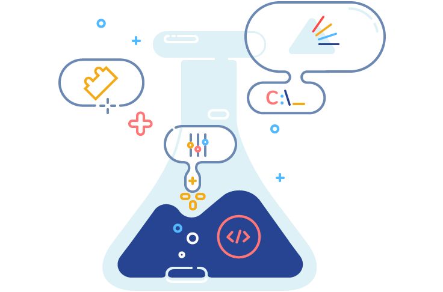

BELLATRIX Test Automation Framework 
---------------------------------------------------------

BELLATRIX is web, desktop, mobile and API test automation framework. It is cross-platform, easily customizable and extensible, increasing tests’ reliability.

In order to deliver seamless user experience, we keep the same structure in the documentation and our Ready-To-Go projects.
This documentation will walk you through the process [**installation**](https://docs.java.bellatrix.solutions/general-information/
)