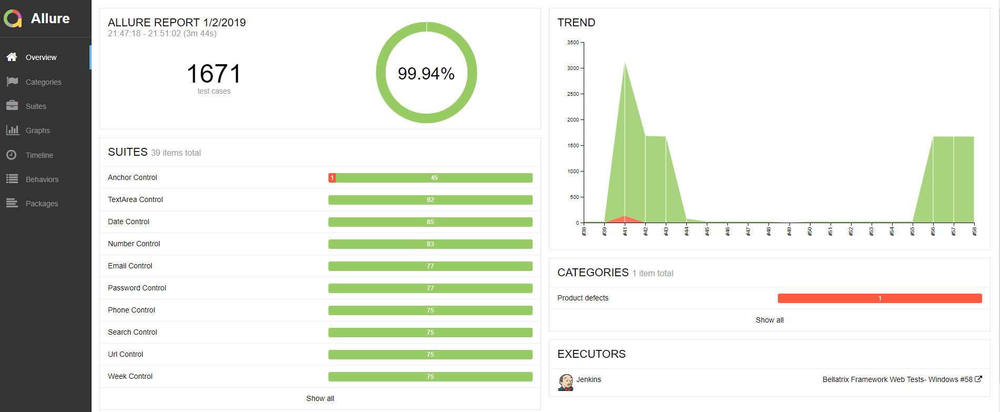
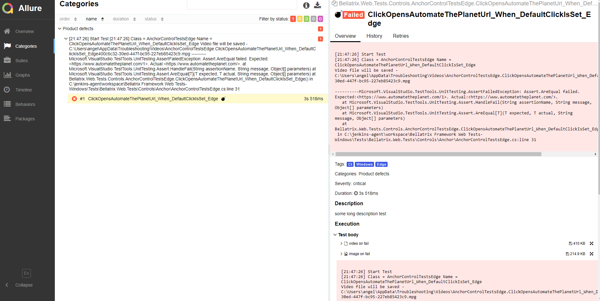
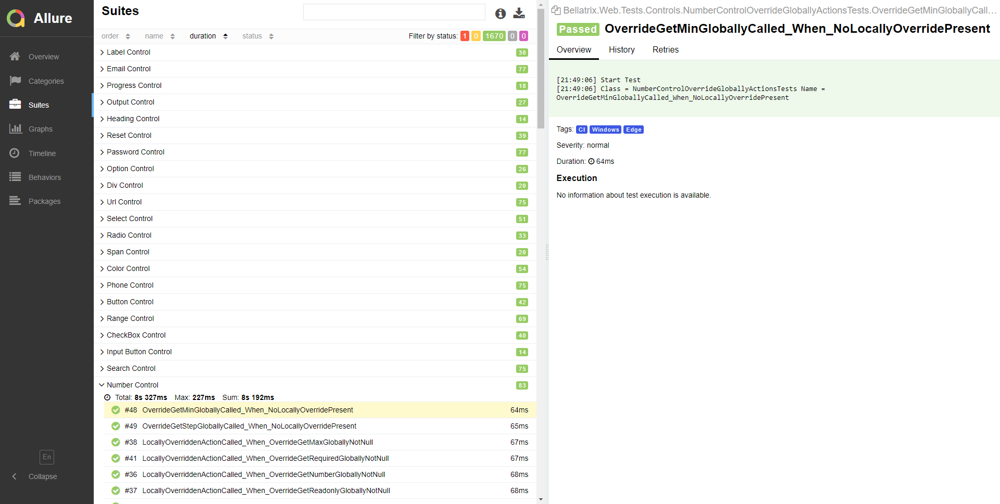
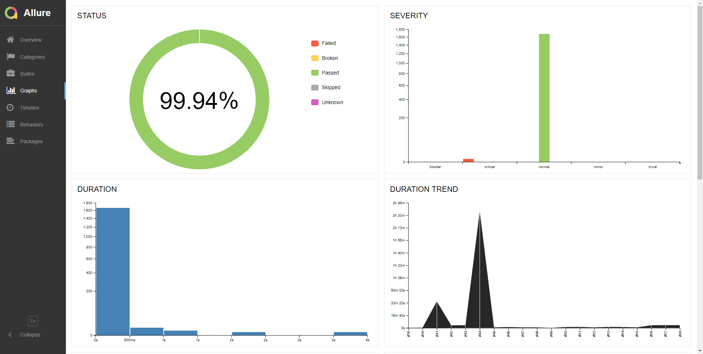

What is Allure?
-------
**[Allure Framework](http://allure.qatools.ru/)** is a flexible lightweight multi-language test report tool that not only shows a very concise representation of what have been tested in a neat web report form. Allure reports shorten common defect lifecycle: test failures can be divided on bugs and broken tests, also logs, steps, fixtures, attachments, timings, history and integrations with TMS and bug-tracking systems. Also, provides a clear 'big picture' of what features have been covered.

You can find a trend of the latest runs. If you have defined any test suites, you will see them and the associated tests count.



You can find a grouping of your tests by features.


In the Categories section- you can see your test failures analyzed and grouped by failure types.



In the Suite section- you can find all of your tests grouped by suites, locate their execution time and the suite total execution time. If there are any failed tests if you click on them, you will see the failed information in the right panel.



The tool also includes some informative summary charts.



Installation
------------

For Windows, Allure is available from the [Scoop](http://scoop.sh/) CLI installer.

To install Allure, download and install Scoop and then execute in the Powershell: 
```
scoop install allure
```

**Manual Installation**
Download the latest version as zip archive from [Maven Central](http://repo.maven.apache.org/maven2/io/qameta/allure/allure-commandline/).
1. Unpack the archive to allure-commandline directory.
2. Navigate to **bin** directory.
3. Use **allure.bat** for Windows or **allure** for other Unix platforms.
4. Add **allure** to system PATH.
**To run CLI application, Java Runtime Environment must be installed.**

For other operating systems refer to the [official documentation](https://docs.qameta.io/allure/#_installing_a_commandline).

Configuration
-------------
You need to install the Allure maven dependencies.
```json
<dependency>
    <groupId>io.qameta.allure</groupId>
    <artifactId>allure-junit5</artifactId>
    <version>RELEASE</version>
    <scope>test</scope>
</dependency>
<dependency>
    <groupId>io.qameta.allure</groupId>
    <artifactId>allure-maven</artifactId>
    <version>RELEASE</version>
</dependency>
```
And the following plugin.
```json
<plugin>
    <groupId>io.qameta.allure</groupId>
    <artifactId>allure-maven</artifactId>
    <version>2.11.2</version>
    <configuration>
        <reportVersion>2.4.1</reportVersion>
    </configuration>
</plugin>
```
After that you can use their annotations to integrate with Allure.